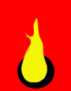

# Aramean GIF animations

## Global tags

- aramean ,aramaean, arami, aramî, aram, arameanlar, oromoyo, oromoye, suryoyo, suroyo, suraye, suryoye, süryaniler, surayt, sorayt, sureth, surit, aramaya, aramaye, aramaic, aramit, syriac, syriaques, suryanice, suryanî, arameiska, syrianska, aramäisch, arameeërs, araméer, arameeërs, arameos, arameus, aramaicos, araméens
- ܐܳܪܳܡܝܳܝܽܘܬܳܐ ,ܣܽܘܪܝܳܝܽܘܬܳܐ ,ܣܘܼܪܲܝܬ ,ܐܪ̈ܡܝܐ ,ܐܪܡܝܐ ,ܣܘܪܝܝܐ ,ܣܘܪܝܐ ,ܣܽܘܪܝܳܝܳܐ ,ܐܳܪܳܡ ,ܐܪܡ
- ארם ,סורי ,אֲרָמִית ,ארמית ,אראמיש ,אָרָמָיָא
- ارام ,آراميون ,الآرامية
- アラム人, アラミアン

| Filter tags | Name |
| :-- | --: |
| דֶגֶל, ܐܳܬܳܐ ,ܐܬܐ, homer, simpson, woohoo, flag, flagga, flagge, drapeau, vlag |  |
| דֶגֶל ,ܐܳܬܳܐ ,ܐܬܐ, dance, dancing, dansa, flag, flagga, flagge, drapeau, vlag |  |
| דֶגֶל ,ܐܳܬܳܐ ,ܐܬܐ, soccer, fotboll, football, voetbal, player, love, flag, flagga, flagge, drapeau, vlag |  |
| דֶגֶל ,ܐܳܬܳܐ ,ܐܬܐ ,ܕܠܰܩ ,ܢܺܐܩܰܕ ,ܢܐܩܕ, burn, fire, agitant, flag, flagga, flagge, drapeau, vlag |  |
| דֶגֶל ,ܐܳܬܳܐ ,ܐܬܐ ,ܕܠܰܩ ,ܢܺܐܩܰܕ ,ܢܐܩܕ, burn, fire, agitant, flag, flagga, flagge, drapeau, vlag |  |
| דֶגֶל ,ܐܳܬܳܐ ,ܐܬܐ, waving, zwaaien, agitant, flag, flagga, flagge, drapeau, vlag |  |
| אִיקוֹנִין ,ܝܩܢ ,ܝܽܘܩܢܳܐ ,ܐܺܝܩܽܘܢܳܐ ,ܢܺܐܩܰܕ ,ܢܐܩܕ, burn, flame, flamme, vlam, icon |  |
| אִיקוֹנִין ,ܝܩܢ ,ܝܽܘܩܢܳܐ ,ܐܺܝܩܽܘܢܳܐ ,ܢܺܐܩܰܕ ,ܢܐܩܕ, burn, flame, flamme, vlam, icon |  |
| דֶגֶל ,ܓܳܠ ,ܓܳܚ ,ܒܩܒܩ ,ܐܳܬܳܐ ,ܐܬܐ, bubble, bubblor, flag, flagga, flagge, drapeau, vlag |  |
| דֶגֶל ,ܢܶܫܪܳܐ ,ܢܫܪܐ ,ܐܳܬܳܐ ,ܐܬܐ , eagle, örn, adelaar, aigle, flag, flagga, flagge, drapeau, vlag |  |
| דֶגֶל ,ܐܳܬܳܐ ,ܐܬܐ, infrared, camera, kamera, flag, flagga, flagge, drapeau, vlag |  |
| דֶגֶל ,ܐܳܬܳܐ ,ܐܬܐ, ardo, democratic flag, flagga, flagge, drapeau, vlag |  |
| דֶגֶל ,ܐܳܬܳܐ ,ܐܬܐ, ardo, democratic flag, flagga, flagge, drapeau, vlag |  |
